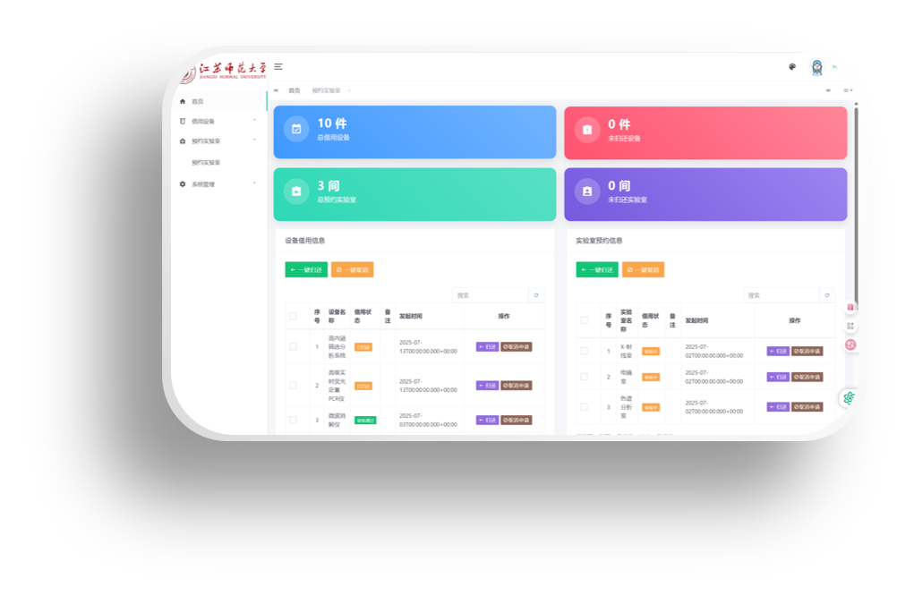
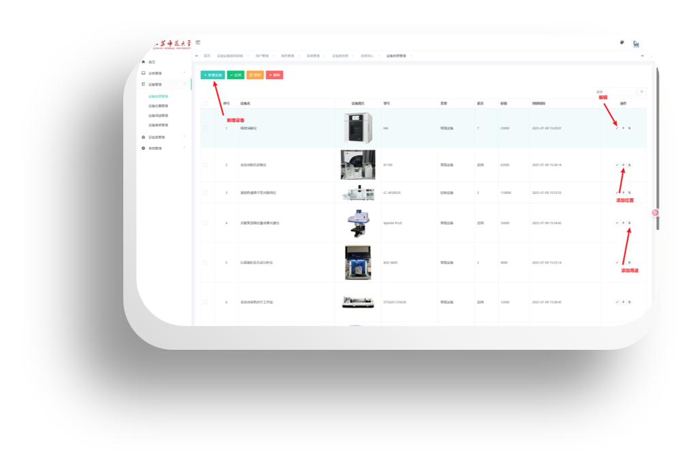
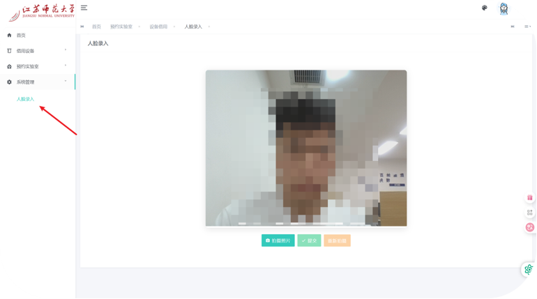
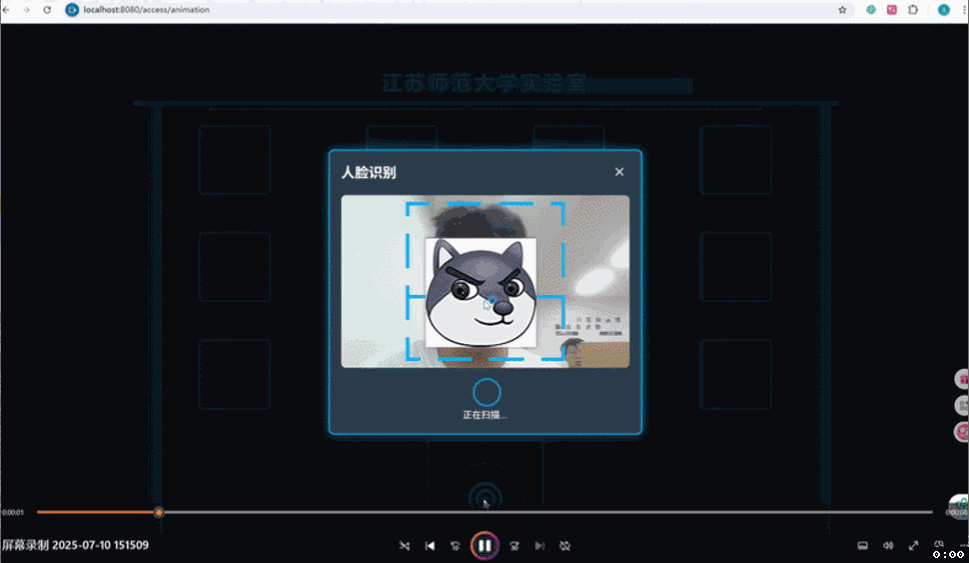
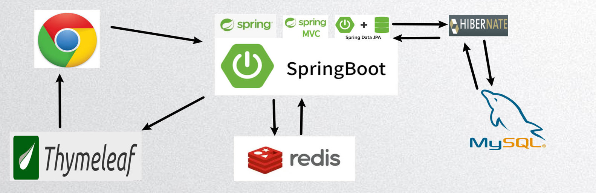
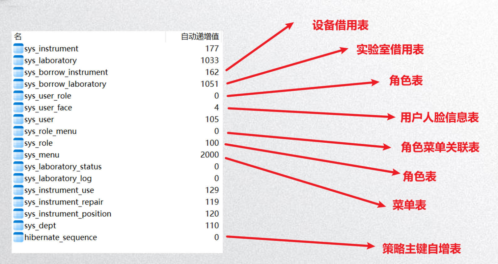

<div align="center">
  <h1>大学实验室预约管理系统</h1>
  <p>基于 Spring Boot + JPA + Thymeleaf 的一体化实验室与仪器预约管理平台</p>

  <p>
    
  </p>

  <p>
    <a href="https://img.shields.io/badge/JDK-1.8+-green.svg"> </a>
    <a href="https://img.shields.io/badge/Spring%20Boot-2.4.x-brightgreen.svg"> </a>
    <a href="https://img.shields.io/badge/Build-Maven-blue.svg"> </a>
    <a href="https://img.shields.io/badge/Database-MySQL%208+-orange.svg"> </a>
    <a href="https://img.shields.io/badge/Cache-Redis-red.svg"> </a>
    <a href="https://img.shields.io/badge/License-MIT-blue.svg"> </a>
  </p>
  <sub>项目背景：江苏师范大学大二暑期实训项目 · 本项目已申请软件著作权</sub>

---

**简介**

- 面向高校实验室场景的预约管理系统，覆盖实验室与仪器的预约、借用、归还、维修、日志等全流程，支持图形验证码、人脸识别、角色权限与菜单管理，助力实验室精细化管理与数据可视化。

## ✨ 核心功能
- 用户与角色权限：登录认证（JWT）、菜单与按钮级权限、角色-菜单关联
- 实验室管理：实验室信息、状态流转、使用日志、可视化仪表盘
- 仪器设备管理：新增/编辑、位置管理、借用/归还、使用登记、维修记录
- 预约与流程：实验室/仪器预约、借用单、归还单、台账记录
- 文件与导入：支持上传与批量导入（如仪器台账）
- 可视化与统计：仪表盘、数据看板
- 安全与体验：图形验证码、基于 Redis 的会话/缓存、人脸识别打通考勤或门禁流程

## 🧰 技术栈
- 后端框架：Spring Boot 2.4.x、Spring MVC、Spring Data JPA
- 认证与安全：JWT、拦截器、校验框架
- 视图层：Thymeleaf + 静态资源（Bootstrap 等）
- 数据存储：MySQL（JPA 自动建表/更新）、Redis 缓存
- 其他组件：阿里 Fastjson、Gson、Easy-Captcha（验证码）
- 构建工具：Maven

## 🖼️ 界面与演示
- 系统首页

  

- 仪器列表页面

  

- 人脸录入页面

  

- 人脸识别成功（GIF 动画）

  

- 系统架构图

  

- 数据库表（示意）

  

## ⚡ 快速开始（Quick Start）
准备：
- JDK 1.8+
- Maven 3.6+（已使用 Maven Wrapper 的话可直接 mvnw）
- MySQL 8+（创建空库 laboratory，UTF8MB4 编码）
- Redis 5+（本地默认端口 6379）

1）克隆代码

```bash
git clone https://github.com/05Huang/University-laboratory-appointment-management-system.git
cd University-laboratory-appointment-management-system
```

2）配置应用（数据库/缓存/密钥）
- 编辑 src/main/resources/application.yml，按需调整以下配置：
  - spring.datasource.url / username / password
  - spring.redis.host / port
  - rsa.private_key（建议替换为你自己的密钥；生产环境请以环境变量或外部配置方式注入，避免明文）
  - server.port（默认 8080）

3）初始化数据库
- 确保已创建空库 laboratory（无需手动建表，JPA 会在首次运行时自动建表：ddl-auto: update）

4）启动项目

```bash
# 方式一：开发运行
mvn spring-boot:run

# 方式二：打包运行
mvn clean package -DskipTests
java -jar target/laboratory-0.0.1-SNAPSHOT.jar
```

5）访问系统
- 浏览器打开：http://localhost:8080
- 首次运行请在系统中创建管理员账号并设置角色与菜单（或按团队规范导入初始数据）

## 🧱 项目结构
```
.
├─ src
│  ├─ main
│  │  ├─ java/com/mafei/laboratory
│  │  │  ├─ commons/        # 通用配置、枚举、异常、拦截器、工具类、JWT 等
│  │  │  ├─ page/           # 页面层控制器
│  │  │  ├─ system/         # 系统领域：controller/entity/repository/service
│  │  │  └─ LaboratoryApplication.java  # 启动类
│  │  └─ resources
│  │     ├─ static/         # CSS/JS/图片等静态资源
│  │     ├─ templates/      # Thymeleaf 模板页面
│  │     └─ application.yml # 核心配置（端口、数据源、Redis、JPA 等）
│  └─ test                  # 单元测试
├─ pom.xml                   # Maven 项目配置与依赖
├─ images/                   # README 引用的演示图片
└─ README.md
```

## ⚙️ 配置与部署
- 数据库
  - 创建 MySQL 数据库 laboratory（UTF8MB4）
  - 根据需要调整连接串参数（时区、字符集、SSL 等）
  - JPA ddl-auto 设置为 update，开发环境自动迁移；生产建议使用受控迁移工具（如 Flyway）
- Redis
  - 默认连接本地 6379，可在 application.yml 中调整
  - 用于验证码、人脸识别流程或会话缓存等
- 安全与密钥
  - JWT、RSA 私钥等敏感配置建议通过环境变量或外部配置注入，避免提交到仓库
- 部署建议
  - 打包：mvn clean package -DskipTests
  - 运行：java -jar target/laboratory-0.0.1-SNAPSHOT.jar --server.port=8080
  - 反向代理：Nginx/Apache，启用 HTTPS；合理配置静态资源缓存

## 🤝 贡献指南
- 提交 Issue：请尽量按照模板描述复现步骤、期望结果与实际结果
- 提交 PR：建议新建分支，遵循 “一个 PR 聚焦一个主题” 原则
- 提交规范：建议使用 Conventional Commits（feat/fix/docs/refactor/test/chore 等）
- 代码风格：保持现有结构与命名；避免提交敏感信息与本地环境文件

## 📄 开源协议
- 本项目采用 MIT 协议开源（若仓库尚未包含 LICENSE 文件，建议新增 MIT License 文件）
- 本项目已申请软件著作权，转载请保留项目出处；商用请遵循协议要求

## 📝 致谢与说明
- 背景：江苏师范大学大二暑期实训项目
- 感谢所有提供反馈与贡献的同学与老师
- 如果该项目对你有帮助，欢迎 Star、Fork 与分享

---

如需功能扩展（如对接门禁硬件、完善预约审批流、接入统一身份认证等），欢迎提出 Issue 或 PR。
